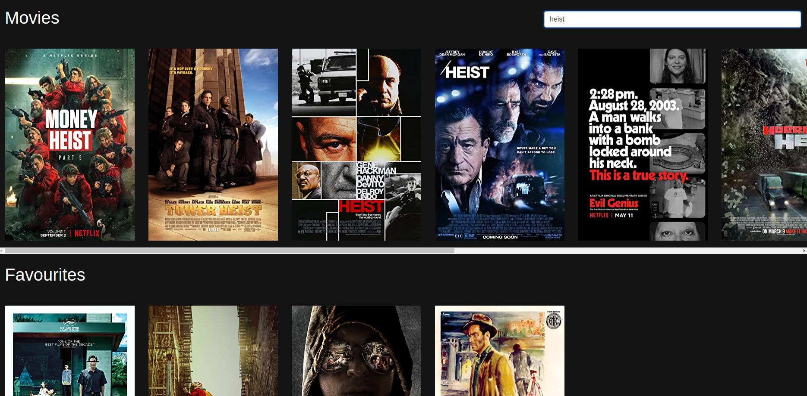

# Movies App in Elm

## Build Instructions

Run the following command from the root of this project:

```bash
elm make src/Main.elm --output=elm.js
```

Then open `index.html` in your browser!

## Screenshot


